# 🗂️ Organigramme Complet - Tank.io

## 🎯 Vue d'Ensemble

```mermaid
graph TB
    subgraph "🎮 Tank.io - Architecture Complète"
        A[Client Browser] --> B[Server Node.js]
        B --> C[Database JSON]
        A --> D[Socket.IO Client]
        B --> E[Socket.IO Server]
        D --> E
    end

    subgraph "📁 Structure Fichiers"
        F[public/] --> G[css/style.css]
        F --> H[js/]
        H --> I[ai/]
        H --> J[network/]
        H --> K[account-system.js]
        H --> L[game.js]
        I --> M[ai-pro.js]
        I --> N[ai-steering.js]
        J --> O[multiplayer.js]
        J --> P[multiplayer-pro.js]
        F --> Q[index.html]

        R[server/] --> S[server.js]
        R --> T[accounts.json]

        U[docs/] --> V[GUIDE_HACKMD.md]
        U --> W[ARCHITECTURE-PRO.md]
        U --> X[MAPS.md]
        U --> Y[POWERUPS.md]
        U --> Z[MOBILE_FEATURES.md]
        U --> AA[MULTI_DEVICE_UPDATE.md]
        U --> BB[archive/]
    end

    style A fill:#e1f5fe
    style B fill:#f3e5f5
    style C fill:#e8f5e8
    style D fill:#fff3e0
    style E fill:#ffebee
```



---

## 🏗️ Architecture Technique Détaillée

```mermaid
graph TD
    subgraph "🌐 Client-Side (Browser)"
        A1[index.html] --> B1[game.js]
        A1 --> C1[account-system.js]
        A1 --> D1[multiplayer.js]
        A1 --> E1[ai-pro.js]
        A1 --> F1[ai-steering.js]
        A1 --> G1[style.css]

        B1 --> H1[Canvas Rendering]
        B1 --> I1[Game Loop 60fps]
        B1 --> J1[Input Handling]
        B1 --> K1[Collision Detection]
        B1 --> L1[Entity Management]

        C1 --> M1[REST API Calls]
        C1 --> N1[Token Management]
        C1 --> O1[Session Storage]

        D1 --> P1[Socket.IO Client]
        D1 --> Q1[State Synchronization]
        D1 --> R1[Client-Side Prediction]
    end

    subgraph "⚙️ Server-Side (Node.js)"
        S1[server.js] --> T1[Express Server]
        S1 --> U1[Socket.IO Server]
        S1 --> V1[File Server]
        S1 --> W1[API REST]

        T1 --> X1[Static Files]
        T1 --> Y1[Port 3000]

        U1 --> Z1[Game State]
        U1 --> AA1[Player Sync]
        U1 --> BB1[Authoritative Logic]

        W1 --> CC1[/api/register]
        W1 --> DD1[/api/login]
        W1 --> EE1[/api/verify-session]
        W1 --> FF1[/api/logout]
        W1 --> GG1[/api/update-stats]
    end

    subgraph "💾 Database"
        HH1[accounts.json] --> II1[User Accounts]
        HH1 --> JJ1[Sessions]
        HH1 --> KK1[Statistics]
        HH1 --> LL1[Match History]
    end

    B1 --> P1
    C1 --> W1
    D1 --> U1
    T1 --> X1
    U1 --> Z1

    style A1 fill:#e3f2fd
    style S1 fill:#f3e5f5
    style HH1 fill:#e8f5e8
```

---

## 🔄 Flux de Données - Architecture Réseau

```mermaid
sequenceDiagram
    participant C as Client Browser
    participant S as Server Node.js
    participant D as Database JSON

    Note over C,S: 🔐 Authentification
    C->>S: POST /api/login (username, password)
    S->>D: Vérifier credentials
    D-->>S: Token + User Data
    S-->>C: Token JWT (7 jours)

    Note over C,S: 🎮 Connexion Jeu
    C->>S: Socket.IO Connect (avec token)
    S->>S: Vérifier session
    S-->>C: Connexion acceptée

    Note over C,S: 🎯 Gameplay
    loop Game Loop (20Hz)
        C->>S: Input (mouvement, tir)
        S->>S: Server Reconciliation
        S-->>C: State Update (tous joueurs)
    end

    Note over C,S: 📊 Statistiques
    C->>S: POST /api/update-stats (victoire/défaite)
    S->>D: Sauvegarder stats
    D-->>S: Confirmation
    S-->>C: Stats mises à jour
```



---

## 🎮 Composants du Jeu - Vue Fonctionnelle

```mermaid
graph TD
    subgraph "🎯 Game Engine"
        A[Game Loop] --> B[Update Logic]
        A --> C[Render Canvas]
        B --> D[Physics Engine]
        B --> E[Collision System]
        B --> F[Entity Manager]
        C --> G[Sprite Rendering]
        C --> H[UI Overlay]
        C --> I[Particle Effects]
    end

    subgraph "🤖 AI System"
        J[AI Manager] --> K[Difficulty Levels]
        J --> L[Behavior Trees]
        J --> M[Pathfinding]
        K --> N[Easy AI]
        K --> O[Medium AI]
        K --> P[Hard AI]
        K --> Q[Impossible AI]
        M --> R[A* Algorithm]
        M --> S[Steering Behaviors]
    end

    subgraph "🌐 Network System"
        T[Multiplayer Core] --> U[Client Prediction]
        T --> V[Server Reconciliation]
        T --> W[Interpolation]
        T --> X[Lag Compensation]
        U --> Y[Input Buffering]
        U --> Z[State Rewind]
        V --> AA[Authoritative State]
        V --> BB[Delta Compression]
    end

    subgraph "📱 Mobile Support"
        CC[Touch Controls] --> DD[Virtual Joystick]
        CC --> EE[Shoot Button]
        CC --> FF[Responsive Design]
        DD --> GG[150px Radius]
        DD --> HH[360° Movement]
        FF --> II[@media queries]
        FF --> JJ[900px breakpoint]
        FF --> KK[600px breakpoint]
    end

    subgraph "💾 Account System"
        LL[User Management] --> MM[Registration]
        LL --> NN[Login]
        LL --> OO[Session Management]
        LL --> PP[Statistics]
        MM --> QQ[SHA-256 Hash]
        MM --> RR[Email Optional]
        OO --> SS[JWT Tokens]
        OO --> TT[7 Days Expiry]
        PP --> UU[Win/Loss Ratio]
        PP --> VV[Match History]
    end

    D --> J
    F --> T
    H --> CC
    B --> LL

    style A fill:#e1f5fe
    style J fill:#f3e5f5
    style T fill:#fff3e0
    style CC fill:#e8f5e8
    style LL fill:#ffebee
```

---

## 🗺️ Maps & Power-ups - Vue Gameplay

```mermaid
graph TD
    subgraph "🗺️ 6 Maps Disponibles"
        A[Map Selection] --> B[Classic]
        A --> C[Destructible]
        A --> D[Lava Hell]
        A --> E[Archipelago]
        A --> F[Portal Maze]
        A --> G[Total Chaos]

        B --> B1[Simple obstacles]
        C --> C1[Destructible walls]
        D --> D1[Lava zones + damage]
        E --> E1[Water + islands]
        F --> F1[Teleport pads]
        G --> G1[All mechanics combined]
    end

    subgraph "⚡ Power-ups System"
        H[Power-up Spawner] --> I[Speed Boost]
        H --> J[Shield]
        H --> K[Triple Shot]

        I --> I1[1.5x speed, 10s]
        J --> J1[Invincibility, 5s]
        K --> K1[3 projectiles, 15s]

        L[Spawn Logic] --> M[15-30s intervals]
        L --> N[Random positions]
        L --> O[Strategic placement]
    end

    subgraph "🎯 Game Modes"
        P[Mode Selection] --> Q[PvP Local]
        P --> R[vs AI]
        P --> S[LAN Multiplayer]

        Q --> Q1[2 players, same PC]
        R --> R1[1 player + AI]
        S --> S1[Network play]
    end

    subgraph "🤖 AI Difficulties"
        T[AI Levels] --> U[Easy]
        T --> V[Medium]
        T --> W[Hard]
        T --> X[Impossible]

        U --> U1[70% accuracy]
        V --> V1[85% accuracy]
        W --> W1[95% accuracy]
        X --> X1[99.5% accuracy + prediction]
    end

    B --> P
    H --> P
    T --> R

    style A fill:#e1f5fe
    style H fill:#f3e5f5
    style P fill:#fff3e0
    style T fill:#ffebee
```



---

## 🔧 Pipeline de Développement


---

## 📊 Métriques & Statistiques


---

## 🎨 Interface Utilisateur - Vue Design


---

## 🔐 Sécurité & Authentification


---

## 📈 Évolution & Roadmap

```mermaid
timeline
    title Évolution de Tank.io
    section v1.0 - Base
        Jeu local 2 joueurs : Jeu de base fonctionnel
        Maps simples : Obstacles statiques
        Contrôles basiques : ZQSD + Espace

    section v2.0 - Multiplayer
        Socket.IO intégré : Communication temps réel
        Client-side prediction : Réduction de la latence
        Mode LAN : Jeu en réseau local

    section v3.0 - Comptes & Mobile
        Système de comptes : Authentification multi-appareils
        Support mobile : Joystick virtuel + responsive
        API REST : Gestion des comptes
        6 maps avancées : Mécaniques uniques

    section v3.1 - Organisation
        Structure professionnelle : Dossiers organisés
        Documentation complète : Guides détaillés
        Publication GitHub : Repository public
        Nettoyage : Archive des anciens fichiers

    section v4.0 - Futures Améliorations
        PWA Support : Installation offline
        Tournaments : Système de compétition
        Custom Maps : Éditeur de cartes
        Cross-Platform : Mobile native apps
        Cloud Hosting : Déploiement Heroku/Docker
```



---

## 📋 Glossaire Technique

| Terme | Définition |
|-------|------------|
| **Client-Side Prediction** | Prédiction locale des mouvements pour masquer la latence |
| **Server Reconciliation** | Correction des prédictions par l'état serveur authoritative |
| **Entity Interpolation** | Lissage des positions entre les updates serveur |
| **Finite State Machine** | Système de comportements IA (PATROL → CHASE → ATTACK) |
| **Delta Compression** | Envoi seulement des changements d'état |
| **Lag Compensation** | Rewind du temps serveur pour les tirs |
| **Responsive Design** | Adaptation automatique à la taille d'écran |
| **Virtual Joystick** | Contrôle tactile circulaire pour mobile |
| **SHA-256 Hashing** | Algorithme de hachage pour les mots de passe |
| **JWT Tokens** | JSON Web Tokens pour l'authentification |

---

<div align="center">

**🗂️ Organigramme Complet - Tank.io**

*Architecture professionnelle avec séparation client/serveur, système de comptes multi-appareils, support mobile complet et IA avancée.*

Made with ❤️ by Thomas-TP  
8 octobre 2025

</div>
