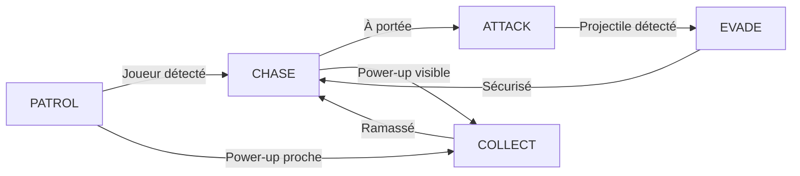

# 🎮 Tank.io - Guide Complet & Documentation

> **Un jeu de combat de tanks multijoueur en temps réel** avec IA avancée, système de comptes synchronisé multi-appareils et support mobile complet.

---

## 📑 Table des Matières

[TOC]

---

## 🎯 Introduction

**Tank.io** est un jeu de combat de tanks développé avec **Node.js**, **Socket.IO** et **HTML5 Canvas**. Il propose une expérience multijoueur fluide avec une architecture serveur authoritative et prédiction côté client.

### 🌟 Caractéristiques Principales

| Fonctionnalité | Description |
|----------------|-------------|
| 🤖 **IA Professionnelle** | 4 niveaux de difficulté (Facile → Impossible) |
| 🌐 **Multijoueur Temps Réel** | Matchmaking automatique, synchronisation serveur |
| 💾 **Comptes Synchronisés** | Authentification multi-appareils avec API REST |
| 📱 **Support Mobile** | Joystick virtuel et design responsive |
| 🗺️ **6 Maps Uniques** | Téléporteurs, zones dangereuses, obstacles destructibles |
| ⚡ **Power-ups** | Speed Boost, Shield, Triple Shot |
| 🎵 **Audio Immersif** | Effets sonores et musique de fond |

---

## 🚀 Installation et Démarrage

### Prérequis

Avant de commencer, assurez-vous d'avoir installé :

- **Node.js** (version 14.x ou supérieure) → [Télécharger](https://nodejs.org/)
- **npm** (inclus avec Node.js)
- Un navigateur moderne (Chrome, Firefox, Safari, Edge)

### Étape 1 : Télécharger le Projet

Vous avez deux options :

#### Option A : Cloner avec Git

```bash
git clone https://github.com/Thomas-TP/Tank.io.git
cd Tank.io
```

#### Option B : Télécharger le ZIP

1. Aller sur https://github.com/Thomas-TP/Tank.io
2. Cliquer sur **Code** → **Download ZIP**
3. Extraire l'archive
4. Ouvrir un terminal dans le dossier extrait

### Étape 2 : Installer les Dépendances

Dans le terminal, exécutez :

```bash
npm install
```

Cette commande va installer :
- `express` - Serveur web
- `socket.io` - Communication temps réel WebSocket

### Étape 3 : Démarrer le Serveur

```bash
npm start
```

Vous verrez cet affichage dans le terminal :

```
==================================================
🎮 SERVEUR TANK.IO PROFESSIONNEL
Architecture: Client-Side Prediction + Server Authoritative
==================================================
✅ Serveur démarré sur le port 3000
📡 Adresse locale: http://localhost:3000
🌐 Adresse LAN: http://192.168.1.10:3000
==================================================
```

### Étape 4 : Accéder au Jeu

#### Sur le même PC :
Ouvrez votre navigateur et allez à :
```
http://localhost:3000
```

#### Sur un autre appareil (même réseau WiFi) :
Utilisez l'adresse LAN affichée par le serveur :
```
http://192.168.1.10:3000
```

:::info
💡 **Astuce :** Remplacez `192.168.1.10` par l'adresse IP affichée dans VOTRE terminal.
:::

---

## 🎮 Modes de Jeu Détaillés

### 1️⃣ Mode PvP Local (2 Joueurs)

Combat sur le même clavier entre deux joueurs.

#### Contrôles

```
┌─────────────────────┬─────────────────────┐
│   JOUEUR 1 (BLEU)   │   JOUEUR 2 (ROUGE)  │
├─────────────────────┼─────────────────────┤
│ Z : Avancer         │ ↑ : Avancer         │
│ S : Reculer         │ ↓ : Reculer         │
│ Q : Gauche          │ ← : Gauche          │
│ D : Droite          │ → : Droite          │
│ Souris : Viser      │ , : Pivoter gauche  │
│ Clic : Tirer        │ . : Pivoter droite  │
│                     │ Entrée : Tirer      │
└─────────────────────┴─────────────────────┘
```

#### Déroulement d'une Partie

1. **Choix de la map** : Sélectionnez parmi 6 maps disponibles
2. **Démarrage** : Compteur de 3 secondes
3. **Combat** : 
   - 6 points de vie par joueur
   - 2 dégâts par projectile
   - 180 secondes par round
4. **Victoire** : Premier à 3 manches gagnées

:::success
🏆 **Objectif :** Éliminez votre adversaire 3 fois avant lui !
:::

---

### 2️⃣ Mode vs IA (Solo)

Affrontez une intelligence artificielle avec **4 niveaux de difficulté**.

#### Niveaux de Difficulté

| Difficulté | 🎯 Précision | ⚡ Vitesse | 🧠 Comportement |
|------------|-------------|-----------|----------------|
| 🟢 **Facile** | 70% | 0.8x | Basique, déplacements simples |
| 🟡 **Moyen** | 85% | 1.0x | Stratégique, évite obstacles |
| 🟠 **Difficile** | 95% | 1.2x | Agressif, utilise power-ups |
| 🔴 **Impossible** | 99.5% | 1.5x | Parfait, prédiction des mouvements |

#### Comportements de l'IA

L'IA utilise une **FSM (Finite State Machine)** avec 5 états :



**Description des états :**

- **PATROL** 🚶 : Explore la map en évitant les obstacles
- **CHASE** 🏃 : Poursuit le joueur en calculant le chemin optimal
- **ATTACK** 🎯 : Tire en prédisant la position future du joueur
- **EVADE** 🛡️ : Esquive les projectiles entrants
- **COLLECT** 💨 : Ramasse les power-ups stratégiques

:::warning
⚠️ **Attention :** En mode Impossible, l'IA a une précision de tir de 99.5% et anticipe vos mouvements !
:::

---

### 3️⃣ Mode LAN (Multijoueur en Réseau)

Jouez avec vos amis sur le même réseau WiFi/Ethernet.

#### Architecture Client-Serveur

```
┌──────────────┐      WebSocket      ┌──────────────┐
│  Joueur 1    │ ←─────────────────→ │   SERVEUR    │
│  (Client)    │   Socket.IO (20Hz)  │              │
└──────────────┘                     │ Authoritative│
                                     │  Game State   │
┌──────────────┐      WebSocket      │              │
│  Joueur 2    │ ←─────────────────→ │   Port 3000  │
│  (Client)    │   Socket.IO (20Hz)  │              │
└──────────────┘                     └──────────────┘
```

#### Fonctionnement du Matchmaking

```sequence
Joueur1->Serveur: findMatch()
Note right of Serveur: Joueur1 en file d'attente
Serveur-->Joueur1: searching...
Joueur2->Serveur: findMatch()
Serveur->Serveur: Match trouvé !
Serveur-->Joueur1: matchFound (playerNumber: 1)
Serveur-->Joueur2: matchFound (playerNumber: 2)
Serveur->Serveur: Créer Game Instance
Serveur-->Joueur1: roundStart (state)
Serveur-->Joueur2: roundStart (state)
```

#### Technologies Utilisées

**Client-Side Prediction :**
- Le client prédit localement le mouvement de son tank
- Évite le lag visuel lors des inputs

**Server Reconciliation :**
- Le serveur envoie l'état authoritative toutes les 50ms
- Le client corrige sa position si désynchronisé

**Entity Interpolation :**
- Les mouvements de l'adversaire sont interpolés
- Garantit une animation fluide malgré la latence

:::info
💡 **Latence optimale :** < 50ms pour une expérience fluide (réseau local)
:::

---

## 💾 Système de Comptes Multi-Appareils

### Problème Résolu

**Avant :** Les comptes étaient stockés dans `localStorage` (local au navigateur)
- ❌ Impossible de se connecter depuis un autre appareil
- ❌ Perte des données si cache navigateur effacé

**Maintenant :** Système serveur avec base de données
- ✅ Connexion depuis n'importe quel appareil
- ✅ Synchronisation en temps réel
- ✅ Statistiques sauvegardées sur le serveur

### Architecture du Système

```
┌─────────────────────────────────────────────────┐
│                                                 │
│  PC Desktop           Tablette          Mobile  │
│       │                  │                │     │
│       └──────────────────┴────────────────┘     │
│                         │                       │
│                         ↓                       │
│          ┌──────────────────────────┐           │
│          │     API REST (Express)   │           │
│          │  /api/register          │           │
│          │  /api/login             │           │
│          │  /api/verify-session    │           │
│          │  /api/update-stats      │           │
│          └──────────────────────────┘           │
│                         │                       │
│                         ↓                       │
│          ┌──────────────────────────┐           │
│          │   accounts.json          │           │
│          │   (Base de données)      │           │
│          │                          │           │
│          │  - Comptes utilisateurs  │           │
│          │  - Statistiques          │           │
│          │  - Historique matchs     │           │
│          │  - Sessions (tokens)     │           │
│          └──────────────────────────┘           │
└─────────────────────────────────────────────────┘
```

### Création de Compte

#### Formulaire d'Inscription

```javascript
Pseudo : MonPseudo
Email : exemple@email.com (optionnel)
Mot de passe : ••••••••

→ Cliquez sur "S'inscrire"
```

#### Processus Backend

1. **Validation** : Vérification pseudo unique, longueur mot de passe
2. **Hashage** : Mot de passe hashé avec SHA-256
3. **Sauvegarde** : Compte créé dans `accounts.json`
4. **Token** : Génération d'un token de session (32 bytes aléatoires)
5. **Réponse** : Token envoyé au client

```json
{
  "success": true,
  "token": "a1b2c3d4e5f6...",
  "username": "MonPseudo",
  "stats": {
    "wins": 0,
    "losses": 0,
    "bestScore": 0,
    "gamesPlayed": 0,
    "totalKills": 0,
    "totalDeaths": 0
  }
}
```

### Connexion Multi-Appareils

#### Scénario d'Utilisation

```
┌─────────────────────────────────────────────────┐
│  LUNDI - PC Desktop                             │
│  → Créer compte "GamerPro"                      │
│  → Jouer 5 parties (3 victoires)                │
│  → Stats sauvegardées sur serveur               │
└─────────────────────────────────────────────────┘
           ↓
┌─────────────────────────────────────────────────┐
│  MARDI - Tablette (même WiFi)                   │
│  → Se connecter avec "GamerPro"                 │
│  → Retrouver ses 3 victoires                    │
│  → Jouer 2 parties supplémentaires              │
│  → Total : 5 victoires affichées                │
└─────────────────────────────────────────────────┘
           ↓
┌─────────────────────────────────────────────────┐
│  MERCREDI - Smartphone (4G/WiFi)                │
│  → Se connecter avec "GamerPro"                 │
│  → Toutes les stats synchronisées ! ✅           │
└─────────────────────────────────────────────────┘
```

### Sécurité

#### Mot de Passe

- **Hashage SHA-256** côté serveur
- Jamais stocké en clair
- Impossible de récupérer le mot de passe original

```javascript
// Exemple de hash
Password: "MonMotDePasse123"
Hash: "5e884898da28047151d0e56f8dc6292773603d0d6aabbdd62a11ef721d1542d8"
```

#### Tokens de Session

- Générés avec `crypto.randomBytes(32)`
- Durée de vie : **7 jours**
- Nettoyage automatique des sessions expirées

```javascript
{
  "token": "a1b2c3d4e5f6789012345678901234567890123456789012345678901234",
  "username": "GamerPro",
  "loginTime": "2024-10-07T14:30:00.000Z"
}
```

:::danger
🔒 **Sécurité :** En production, utilisez **bcrypt** pour hacher les mots de passe avec un **salt** unique par utilisateur.
:::

### Statistiques Sauvegardées

```json
{
  "username": "GamerPro",
  "email": "gamer@pro.com",
  "password": "hash_sha256...",
  "stats": {
    "wins": 15,
    "losses": 8,
    "bestScore": 1250,
    "gamesPlayed": 23,
    "totalKills": 42,
    "totalDeaths": 18
  },
  "matchHistory": [
    {
      "date": "2024-10-07T14:30:00.000Z",
      "won": true,
      "score": 1250,
      "kills": 3,
      "deaths": 1
    }
  ],
  "createdAt": "2024-10-01T10:00:00.000Z"
}
```

---

## 📱 Support Mobile & Responsive Design

### Détection Intelligente

Le jeu détecte automatiquement le type d'appareil :

```javascript
const isMobileDevice = 
    /Android|webOS|iPhone|iPad|iPod|BlackBerry|IEMobile|Opera Mini/i
    .test(navigator.userAgent) || 
    (window.innerWidth <= 1024 && 'ontouchstart' in window);
```

**Résultat :**
- Desktop avec écran tactile → ❌ Pas de joystick
- Tablette / Smartphone → ✅ Joystick affiché

### Joystick Virtuel

#### Interface

```
┌───────────────────────────────────────┐
│                                       │
│        [Zone de jeu Canvas]           │
│                                       │
│                                       │
│                                       │
│                                       │
│  ┌─────┐                     ┌────┐  │
│  │  ○  │ Joystick           │ 💥 │  │
│  │  ◉  │ (150px)            │    │  │
│  └─────┘                     └────┘  │
│          Mouvement          Tir      │
│          360°               (90px)   │
└───────────────────────────────────────┘
```

#### Fonctionnement

**Touch Events :**
```javascript
joystickContainer.addEventListener('touchstart', (e) => {
    // Enregistrer position de départ
    joystickCenter = { x: touch.clientX, y: touch.clientY };
    joystickActive = true;
});

joystickContainer.addEventListener('touchmove', (e) => {
    // Calculer angle et distance
    const angle = Math.atan2(dx, -dy);
    const distance = Math.min(Math.sqrt(dx*dx + dy*dy), 45);
    
    // Mapper vers ZQSD
    player1.keys['KeyZ'] = Math.abs(angle) < Math.PI/4;
    player1.keys['KeyS'] = Math.abs(angle) > 3*Math.PI/4;
    player1.keys['KeyQ'] = angle < -Math.PI/4 && angle > -3*Math.PI/4;
    player1.keys['KeyD'] = angle > Math.PI/4 && angle < 3*Math.PI/4;
});
```

**Mapping Directionnel :**
```
         ↑ (KeyZ)
         │
    ←────┼────→
    (KeyQ)│(KeyD)
         │
         ↓ (KeyS)
```

### Design Responsive

#### Breakpoints

```css
/* Desktop (> 900px) */
h1 { font-size: 3em; }
canvas { width: 800px; height: 600px; }

/* Tablette (≤ 900px) */
@media (max-width: 900px) {
    h1 { font-size: 2em; }
    canvas { width: 100%; height: auto; }
    #ui { font-size: 0.85em; }
}

/* Mobile (≤ 600px) */
@media (max-width: 600px) {
    h1 { font-size: 1.5em; }
    .menu-title { font-size: 2em; }
    .menu-button { font-size: 0.85em; padding: 8px 12px; }
    #auth-modal { width: 95%; }
    #pause-menu { width: 85%; }
}
```

#### Adaptation du Canvas

```javascript
function resizeCanvas() {
    const aspectRatio = 800 / 600; // 4:3
    
    if (window.innerWidth < 900) {
        const maxWidth = window.innerWidth;
        const maxHeight = window.innerHeight - 100; // Espace pour joystick
        
        if (maxWidth / maxHeight > aspectRatio) {
            canvas.style.height = maxHeight + 'px';
            canvas.style.width = (maxHeight * aspectRatio) + 'px';
        } else {
            canvas.style.width = maxWidth + 'px';
            canvas.style.height = (maxWidth / aspectRatio) + 'px';
        }
    }
}
```

### Optimisations Performances

#### Limites d'Entités

Pour éviter le lag sur mobiles :

```javascript
const MAX_PARTICLES = 100;    // Particules d'explosion
const MAX_PROJECTILES = 50;   // Projectiles actifs

if (particles.length > MAX_PARTICLES) {
    particles = particles.slice(0, MAX_PARTICLES);
}

if (projectiles.length > MAX_PROJECTILES) {
    projectiles = projectiles.slice(0, MAX_PROJECTILES);
}
```

#### Suivi FPS

```javascript
let fpsCounter = 0;
let currentFPS = 60;
let lastFpsUpdate = Date.now();

function gameLoop() {
    fpsCounter++;
    
    if (Date.now() - lastFpsUpdate > 1000) {
        currentFPS = fpsCounter;
        fpsCounter = 0;
        lastFpsUpdate = Date.now();
        
        // Afficher dans la console
        console.log('FPS:', currentFPS);
    }
}
```

---

## 🗺️ Les 6 Maps Uniques

### 1. 🏜️ Desert Storm (Désert)

**Thème :** Champ de bataille désertique  
**Mécaniques :** Obstacles rocheux classiques  
**Couleur dominante :** `#d4a574` (Sable)

```
┌────────────────────────────────────┐
│  ░░  ░░░     ░░      ░░░  ░░      │
│   ░░    ░░░          ░░     ░░    │
│      ░░      ░░░  ░░    ░░░   ░░  │
│  ░░     ░░░       ░░         ░░   │
│     ░░      ░░  ░░     ░░░        │
└────────────────────────────────────┘
  ░░ = Rochers
```

**Stratégie :** Utiliser les rochers comme couverture

---

### 2. 🏙️ Urban Warfare (Ville)

**Thème :** Combat urbain  
**Mécaniques :** Nombreux bâtiments rectangulaires  
**Couleur dominante :** `#808080` (Gris béton)

```
┌────────────────────────────────────┐
│  ██  ██      ██      ██  ██        │
│  ██  ██   ████████   ██  ██        │
│     ████      ██         ████      │
│      ██    ██  ██  ██    ██        │
│  ██      ████████        ██  ██    │
└────────────────────────────────────┘
  ██ = Bâtiments
```

**Stratégie :** Créer des embuscades entre les bâtiments

---

### 3. ❄️ Arctic Base (Arctique)

**Thème :** Base arctique secrète  
**Mécaniques :** **Téléporteurs**  
**Couleur dominante :** `#e0f2ff` (Glace)

```
┌────────────────────────────────────┐
│  ▓▓  ▓▓    🌀      ▓▓  ▓▓  🌀      │
│   ▓▓    ▓▓▓    ▓▓     ▓▓           │
│      ▓▓  🌀  ▓▓▓  ▓▓    ▓▓▓   ▓▓   │
│  ▓▓     ▓▓▓       ▓▓         ▓▓    │
│   🌀  ▓▓      ▓▓  ▓▓     ▓▓▓  🌀   │
└────────────────────────────────────┘
  ▓▓ = Blocs de glace
  🌀 = Téléporteurs (4 paires)
```

**Méca unique :** Entrer dans un téléporteur vous envoie à son jumeau

**Stratégie :** Utiliser les téléporteurs pour échapper ou surprendre

---

### 4. 🌲 Forest Arena (Forêt)

**Thème :** Arène forestière  
**Mécaniques :** **Zones de dégâts** (feu)  
**Couleur dominante :** `#2d5016` (Vert forêt)

```
┌────────────────────────────────────┐
│  🌳  🌳  🔥     🌳    🌳  🌳        │
│   🌳    🌳🌳  🔥     🌳     🌳      │
│      🌳      🌳🌳  🌳🔥   🌳🌳  🌳  │
│  🌳  🔥  🌳🌳     🔥  🌳       🌳   │
│     🌳    🔥 🌳  🌳     🌳🌳        │
└────────────────────────────────────┘
  🌳 = Arbres
  🔥 = Zones de feu (1 dégât/s)
```

**Méca unique :** Zones rouges = **Feu** (1 dégât/seconde)

**Stratégie :** Éviter le feu, forcer l'ennemi dedans

---

### 5. 🏭 Industrial Zone (Usine)

**Thème :** Zone industrielle  
**Mécaniques :** **Obstacles destructibles**  
**Couleur dominante :** `#4a4a4a` (Acier)

```
┌────────────────────────────────────┐
│  ■■  ■■      ■■      ■■  ■■        │
│  ■■  ■■   ■■■■■■■■   ■■  ■■        │
│     ■■■■      ■■         ■■■■      │
│      ■■    ■■  ■■  ■■    ■■        │
│  ■■      ■■■■■■■■        ■■  ■■    │
└────────────────────────────────────┘
  ■■ = Conteneurs (destructibles après 3 impacts)
```

**Méca unique :** Les conteneurs peuvent être détruits (3 tirs)

**Stratégie :** Détruire les obstacles pour créer des passages

---

### 6. 🌋 Volcanic Valley (Volcan)

**Thème :** Vallée volcanique  
**Mécaniques :** **Lave + Téléporteurs**  
**Couleur dominante :** `#1a1a1a` (Roche volcanique)

```
┌────────────────────────────────────┐
│  ██  🌀    🔥🔥      ██  ██  🌀     │
│  ██  ██   🔥🔥🔥🔥    ██  ██         │
│     ████   🔥🔥     🌀    ████      │
│      ██  🔥  ██  ██  🔥   ██        │
│  ██    🔥🔥████🔥🔥  🌀    ██  ██    │
└────────────────────────────────────┘
  ██ = Roches volcaniques
  🔥 = Lave (2 dégâts/s)
  🌀 = Téléporteurs (3 paires)
```

**Méca unique :** Lave (2 dégâts/seconde) + Téléporteurs

**Stratégie :** Map la plus difficile, combinaison des deux mécaniques

---

## ⚡ Power-ups Stratégiques

### Types de Power-ups

#### 1. 💨 Speed Boost (Vitesse x1.5)

**Durée :** 10 secondes  
**Effet visuel :** Particules bleues derrière le tank  
**Couleur :** Cyan `#00bfff`

```
┌────────┐
│   💨   │
│ SPEED  │
└────────┘
```

**Stratégies :**
- ✅ Échapper rapidement à un danger
- ✅ Rattraper un adversaire en fuite
- ✅ Traverser des zones dangereuses
- ❌ Ne pas foncer sans regarder

---

#### 2. 🛡️ Shield (Invincibilité)

**Durée :** 5 secondes  
**Effet visuel :** Bouclier doré autour du tank  
**Couleur :** Or `#ffd700`

```
┌────────┐
│   🛡️   │
│ SHIELD │
└────────┘
```

**Stratégies :**
- ✅ Foncer sur l'adversaire sans risque
- ✅ Traverser des zones de lave/feu
- ✅ Tanker les projectiles ennemis
- ⚠️ Courte durée, agir vite !

---

#### 3. 🔫 Triple Shot (3 Projectiles)

**Durée :** 15 secondes  
**Effet visuel :** 3 projectiles en éventail  
**Couleur :** Rouge `#ff0000`

```
┌────────┐
│   🔫   │
│ TRIPLE │
└────────┘

Tir normal:    •
Triple Shot:  • • •
              ↖ ↑ ↗
```

**Stratégies :**
- ✅ Couvrir plus de zone
- ✅ Difficile d'esquiver 3 projectiles
- ✅ Détruire obstacles rapidement
- ⚠️ Consomme 3x plus de munitions

---

### Apparition & Positionnement

**Timing :**
- Premier power-up : 15 secondes après le début
- Power-ups suivants : Toutes les 20-30 secondes (aléatoire)
- Maximum 2 power-ups sur la map simultanément

**Position :**
```javascript
// Algorithme de spawn
const spawnPowerUp = () => {
    let x, y, valid;
    do {
        x = Math.random() * (800 - 60) + 30;
        y = Math.random() * (600 - 60) + 30;
        
        // Vérifier collision avec obstacles
        valid = !checkCollisionWithObstacles(x, y);
        
        // Vérifier distance minimale avec tanks (200px)
        valid = valid && distanceToPlayer1 > 200;
        valid = valid && distanceToPlayer2 > 200;
    } while (!valid);
    
    return { x, y, type: randomType() };
};
```

**Affichage :**
```
┌────────────────────────────────────┐
│  Tank1                             │
│    ↓                     💨         │
│   🔵                               │
│            ██  ██                  │
│                    🛡️   ██  ██     │
│                                    │
│                     🔫             │
│                          🔴        │
│                          ↑         │
│                        Tank2       │
└────────────────────────────────────┘
```

---

## 🔧 Configuration Réseau (LAN)

### Problème : Pare-feu Windows

Par défaut, Windows bloque les connexions entrantes. Vous devez autoriser le port 3000.

#### Solution 1 : Interface Graphique

1. **Ouvrir le Pare-feu Windows**
   - Panneau de configuration → Système et sécurité
   - Pare-feu Windows Defender → Paramètres avancés

2. **Créer une règle entrante**
   - Cliquer sur "Règles de trafic entrant"
   - Cliquer sur "Nouvelle règle..."

3. **Configuration**
   ```
   Type de règle : Port
   Protocole : TCP
   Port : 3000
   Action : Autoriser la connexion
   Profil : Cocher tous (Domaine, Privé, Public)
   Nom : Tank.IO Server
   ```

4. **Valider**
   - Cliquer sur "Terminer"

#### Solution 2 : PowerShell (Administrateur)

```powershell
New-NetFirewallRule -DisplayName "Tank.IO Server" `
    -Direction Inbound `
    -Protocol TCP `
    -LocalPort 3000 `
    -Action Allow `
    -Profile Any
```

### Trouver votre Adresse IP Locale

#### Windows

**Méthode 1 : Interface graphique**
```
Paramètres → Réseau et Internet → 
État → Propriétés → Adresse IPv4
```

**Méthode 2 : CMD/PowerShell**
```powershell
ipconfig
```
Cherchez "Adresse IPv4" sous votre connexion active (Ethernet ou WiFi).

**Méthode 3 : PowerShell avancé**
```powershell
(Get-NetIPAddress -AddressFamily IPv4 | 
 Where-Object {$_.InterfaceAlias -like "*Ethernet*" -or 
                $_.InterfaceAlias -like "*Wi-Fi*"}).IPAddress
```

#### Linux/Mac

```bash
ifconfig
# ou
ip addr show
```

### Test de Connectivité

Sur un autre appareil, testez la connexion :

```bash
# Ping l'adresse du serveur
ping 192.168.1.10

# Test du port
telnet 192.168.1.10 3000
```

Si le ping fonctionne mais pas telnet → Problème de pare-feu

---

## 🏗️ Architecture Technique Avancée

### Client-Side Prediction

#### Problème : Latence Réseau

Sans prédiction :
```
Joueur appuie sur Z
    ↓ (50ms réseau)
Serveur reçoit input
    ↓ (traitement)
Serveur envoie nouvel état
    ↓ (50ms réseau)
Client affiche mouvement

TOTAL : 100ms+ de délai perçu
```

Avec prédiction :
```
Joueur appuie sur Z
    ↓ (INSTANTANÉ)
Client prédit localement → Mouvement affiché
    ↓ (50ms réseau, en parallèle)
Serveur valide
    ↓ (50ms réseau)
Client réconcilie si nécessaire

TOTAL : ~0ms de délai perçu
```

#### Implémentation

```javascript
class Tank {
    constructor() {
        this.x = 100;
        this.y = 300;
        this.predictedX = 100;
        this.predictedY = 300;
        this.inputSequence = 0;
        this.pendingInputs = [];
    }
    
    // Client : Prédire le mouvement
    update() {
        if (this.keys['KeyZ']) {
            this.predictedX += Math.sin(this.angle) * 2;
            this.predictedY -= Math.cos(this.angle) * 2;
        }
        
        // Sauvegarder l'input
        this.pendingInputs.push({
            sequence: this.inputSequence++,
            keys: {...this.keys},
            angle: this.angle
        });
        
        // Envoyer au serveur
        socket.emit('playerInput', this.pendingInputs[this.pendingInputs.length - 1]);
    }
    
    // Client : Réconcilier avec serveur
    reconcile(serverState) {
        const lastProcessed = serverState.lastProcessedInput;
        
        // Supprimer les inputs déjà traités
        this.pendingInputs = this.pendingInputs.filter(
            input => input.sequence > lastProcessed
        );
        
        // Position authoritative du serveur
        this.x = serverState.x;
        this.y = serverState.y;
        
        // Rejouer les inputs non traités
        this.pendingInputs.forEach(input => {
            // Appliquer le mouvement localement
            if (input.keys['KeyZ']) {
                this.x += Math.sin(input.angle) * 2;
                this.y -= Math.cos(input.angle) * 2;
            }
        });
        
        // Mettre à jour la position prédite
        this.predictedX = this.x;
        this.predictedY = this.y;
    }
}
```

### Entity Interpolation

Pour l'adversaire (dont on ne contrôle pas le mouvement) :

```javascript
class OpponentTank {
    constructor() {
        this.x = 700;
        this.y = 300;
        this.targetX = 700;
        this.targetY = 300;
        this.serverUpdates = [];
    }
    
    // Recevoir une mise à jour serveur
    onServerUpdate(state) {
        this.serverUpdates.push({
            x: state.x,
            y: state.y,
            angle: state.angle,
            timestamp: Date.now()
        });
        
        // Garder seulement les 2 dernières
        if (this.serverUpdates.length > 2) {
            this.serverUpdates.shift();
        }
    }
    
    // Interpoler entre les positions
    update() {
        if (this.serverUpdates.length < 2) return;
        
        const now = Date.now();
        const render_timestamp = now - 100; // 100ms dans le passé
        
        const [older, newer] = this.serverUpdates;
        
        const time_diff = newer.timestamp - older.timestamp;
        const time_elapsed = render_timestamp - older.timestamp;
        const t = time_elapsed / time_diff; // Ratio interpolation
        
        // Interpolation linéaire
        this.x = older.x + (newer.x - older.x) * t;
        this.y = older.y + (newer.y - older.y) * t;
        this.angle = older.angle + (newer.angle - older.angle) * t;
    }
}
```

### Server Authoritative

Le serveur est la **seule source de vérité** :

```javascript
// server.js
class Game {
    processInput(playerNum, input) {
        const player = this.state[`player${playerNum}`];
        
        // VALIDATION SERVEUR
        const speed = 2; // Ne pas faire confiance au client
        
        if (input.forward) {
            const newX = player.x + Math.sin(player.angle) * speed;
            const newY = player.y - Math.cos(player.angle) * speed;
            
            // Vérifier collisions serveur
            if (!this.checkCollision(newX, newY)) {
                player.x = newX;
                player.y = newY;
            }
        }
        
        // Tir avec cooldown serveur (anti-triche)
        if (input.shoot && Date.now() - player.lastShot > 500) {
            player.lastShot = Date.now();
            this.spawnProjectile(player);
        }
        
        // Sauvegarder le dernier input traité
        this.players[`player${playerNum}`].lastProcessedInput = input.sequenceNumber;
    }
}
```

**Avantages :**
- ❌ Impossible de tricher (vitesse, téléportation, etc.)
- ✅ Collisions validées côté serveur
- ✅ Cooldown de tir appliqué côté serveur
- ✅ Détection de collision identique pour tous

---

## 🎵 Système Audio

### Sons Disponibles

| Fichier | Événement | Source |
|---------|-----------|--------|
| `tank_shoot.wav` | Tir de projectile | Mixkit |
| `tank_hit.wav` | Impact sur tank | Mixkit |
| `tank_explosion.wav` | Destruction de tank | Mixkit |
| `powerup_collect.wav` | Ramassage power-up | Mixkit |
| `game_music.mp3` | Musique de fond | Mixkit |
| `round_start.wav` | Début de round | Mixkit |
| `game_over.wav` | Fin de partie | Mixkit |

### Implémentation

```javascript
const sounds = {
    shoot: new Audio('sounds/tank_shoot.wav'),
    hit: new Audio('sounds/tank_hit.wav'),
    explosion: new Audio('sounds/tank_explosion.wav'),
    powerup: new Audio('sounds/powerup_collect.wav'),
    music: new Audio('sounds/game_music.mp3'),
    roundStart: new Audio('sounds/round_start.wav'),
    gameOver: new Audio('sounds/game_over.wav')
};

// Configuration
sounds.music.loop = true;
sounds.music.volume = 0.3;

// Utilisation
function shootProjectile() {
    sounds.shoot.currentTime = 0; // Reset pour tirs rapides
    sounds.shoot.play();
    // ... logique de tir
}
```

### Politique des Navigateurs

Depuis Chrome 66+, l'audio nécessite une **interaction utilisateur**.

**Solution implémentée :**
```javascript
// Première interaction utilisateur
document.addEventListener('click', () => {
    sounds.music.play().catch(e => {
        console.log('Musique bloquée par le navigateur');
    });
}, { once: true });
```

---

## 📊 API REST Documentation

### Base URL

```
http://localhost:3000/api
```

### Endpoints

#### POST /api/register

Créer un nouveau compte utilisateur.

**Request Body :**
```json
{
  "username": "string (3-20 caractères)",
  "email": "string (optionnel)",
  "password": "string (4+ caractères)"
}
```

**Response Success (200) :**
```json
{
  "success": true,
  "token": "string (64 caractères hex)",
  "username": "string",
  "stats": {
    "wins": 0,
    "losses": 0,
    "bestScore": 0,
    "gamesPlayed": 0,
    "totalKills": 0,
    "totalDeaths": 0
  }
}
```

**Response Error (400) :**
```json
{
  "success": false,
  "message": "Ce pseudo existe déjà"
}
```

---

#### POST /api/login

Se connecter à un compte existant.

**Request Body :**
```json
{
  "username": "string",
  "password": "string"
}
```

**Response Success (200) :**
```json
{
  "success": true,
  "token": "string",
  "username": "string",
  "stats": { ... },
  "matchHistory": [ ... ]
}
```

**Response Error (401) :**
```json
{
  "success": false,
  "message": "Identifiants incorrects"
}
```

---

#### POST /api/verify-session

Vérifier la validité d'un token de session.

**Request Body :**
```json
{
  "token": "string"
}
```

**Response Success (200) :**
```json
{
  "success": true,
  "username": "string",
  "stats": { ... },
  "matchHistory": [ ... ]
}
```

**Response Error (401) :**
```json
{
  "success": false,
  "message": "Session invalide"
}
```

---

#### POST /api/update-stats

Mettre à jour les statistiques d'un joueur.

**Request Body :**
```json
{
  "token": "string",
  "stats": {
    "wins": "number",
    "losses": "number",
    "bestScore": "number",
    "gamesPlayed": "number",
    "kills": "number",
    "deaths": "number"
  },
  "matchData": {
    "date": "ISO 8601 string",
    "won": "boolean",
    "score": "number",
    "kills": "number",
    "deaths": "number"
  }
}
```

**Response Success (200) :**
```json
{
  "success": true,
  "stats": { ... }
}
```

---

#### POST /api/logout

Se déconnecter et invalider le token.

**Request Body :**
```json
{
  "token": "string"
}
```

**Response Success (200) :**
```json
{
  "success": true
}
```

---

## 🚀 Déploiement en Production

### Option 1 : Heroku (Gratuit)

```bash
# 1. Installer Heroku CLI
# https://devcenter.heroku.com/articles/heroku-cli

# 2. Se connecter
heroku login

# 3. Créer une app
heroku create tank-io-game

# 4. Déployer
git push heroku main

# 5. Ouvrir l'app
heroku open
```

### Option 2 : Docker

**Dockerfile :**
```dockerfile
FROM node:20-alpine

WORKDIR /app

COPY package*.json ./
RUN npm install --production

COPY . .

EXPOSE 3000

CMD ["npm", "start"]
```

**docker-compose.yml :**
```yaml
version: '3.8'

services:
  tank-io:
    build: .
    ports:
      - "3000:3000"
    volumes:
      - ./accounts.json:/app/accounts.json
    environment:
      - NODE_ENV=production
    restart: unless-stopped
```

**Commandes :**
```bash
# Build
docker-compose build

# Run
docker-compose up -d

# Logs
docker-compose logs -f

# Stop
docker-compose down
```

### Option 3 : VPS (DigitalOcean, AWS, etc.)

```bash
# 1. SSH vers le serveur
ssh user@your-server-ip

# 2. Installer Node.js
curl -fsSL https://deb.nodesource.com/setup_20.x | sudo -E bash -
sudo apt-get install -y nodejs

# 3. Cloner le projet
git clone https://github.com/Thomas-TP/Tank.io.git
cd Tank.io

# 4. Installer dépendances
npm install --production

# 5. Installer PM2 (Process Manager)
sudo npm install -g pm2

# 6. Démarrer l'app
pm2 start server.js --name tank-io

# 7. Configurer le démarrage automatique
pm2 startup
pm2 save

# 8. Configurer Nginx (reverse proxy)
sudo apt install nginx
```

**Configuration Nginx :**
```nginx
server {
    listen 80;
    server_name yourdomain.com;

    location / {
        proxy_pass http://localhost:3000;
        proxy_http_version 1.1;
        proxy_set_header Upgrade $http_upgrade;
        proxy_set_header Connection 'upgrade';
        proxy_set_header Host $host;
        proxy_cache_bypass $http_upgrade;
    }
}
```

---

## 🤝 Contribution au Projet

### Comment Contribuer ?

1. **Fork le projet**
   ```bash
   # Sur GitHub, cliquer sur "Fork"
   ```

2. **Cloner votre fork**
   ```bash
   git clone https://github.com/VOTRE-USERNAME/Tank.io.git
   cd Tank.io
   ```

3. **Créer une branche**
   ```bash
   git checkout -b feature/ma-nouvelle-fonctionnalite
   ```

4. **Faire vos modifications**
   ```bash
   # Éditer les fichiers
   git add .
   git commit -m "Ajout de la fonctionnalité X"
   ```

5. **Pousser vers GitHub**
   ```bash
   git push origin feature/ma-nouvelle-fonctionnalite
   ```

6. **Créer une Pull Request**
   - Aller sur GitHub
   - Cliquer sur "Compare & pull request"
   - Décrire vos changements
   - Soumettre

### Guidelines de Code

**Style JavaScript :**
```javascript
// ✅ BON
function calculateDistance(x1, y1, x2, y2) {
    const dx = x2 - x1;
    const dy = y2 - y1;
    return Math.sqrt(dx * dx + dy * dy);
}

// ❌ MAUVAIS
function calc(a,b,c,d){return Math.sqrt((c-a)*(c-a)+(d-b)*(d-b))}
```

**Commentaires :**
```javascript
// ✅ BON : Commentaire en français, clair
// Calculer la distance entre deux points
const distance = calculateDistance(x1, y1, x2, y2);

// ❌ MAUVAIS : Pas de commentaire
const d = Math.sqrt((x2-x1)*(x2-x1)+(y2-y1)*(y2-y1));
```

### Idées de Contributions

- [ ] Nouveaux power-ups (freeze, teleport, etc.)
- [ ] Maps supplémentaires (espace, jungle, etc.)
- [ ] Mode tournoi (brackets, classement)
- [ ] Chat en jeu
- [ ] Skins de tanks personnalisables
- [ ] Système de replay
- [ ] Spectateur pour les matchs en cours
- [ ] Support de plus de 2 joueurs
- [ ] Mode coopératif contre l'IA

---

## 📝 Changelog

### Version 3.0 - Multi-Device & Mobile (Octobre 2024)

**Nouveautés :**
- ✅ Système de comptes synchronisé multi-appareils
- ✅ API REST complète (register, login, stats)
- ✅ Support mobile avec joystick virtuel
- ✅ Design responsive (desktop, tablette, mobile)
- ✅ Optimisations performances (FPS tracking, limites d'entités)
- ✅ Base de données JSON côté serveur

**Améliorations :**
- 🔧 Sécurité : Mots de passe hashés SHA-256
- 🔧 Sessions avec tokens (7 jours)
- 🔧 Historique des 50 dernières parties
- 🔧 Détection intelligente des appareils mobiles

---

### Version 2.0 - Maps & Power-ups (Septembre 2024)

**Nouveautés :**
- ✅ 6 maps uniques avec mécaniques spéciales
- ✅ Système de power-ups (Speed, Shield, Triple Shot)
- ✅ Téléporteurs (Arctic Base, Volcanic Valley)
- ✅ Zones de dégâts (Forest Arena, Volcanic Valley)
- ✅ Obstacles destructibles (Industrial Zone)

**Améliorations :**
- 🔧 IA améliorée (4 difficultés)
- 🔧 Effets visuels (particules, traînées)
- 🔧 Système audio complet
- 🔧 Interface utilisateur améliorée

---

### Version 1.0 - Multijoueur LAN (Août 2024)

**Première version :**
- ✅ Mode PvP local (2 joueurs)
- ✅ Mode vs IA (facile, moyen, difficile)
- ✅ Mode LAN avec matchmaking
- ✅ Client-side prediction
- ✅ Server reconciliation
- ✅ Entity interpolation

---

## 📞 Support & Contact

### Besoin d'Aide ?

- **GitHub Issues :** [Tank.io/issues](https://github.com/Thomas-TP/Tank.io/issues)
- **Email :** [Contacter le développeur](mailto:contact@example.com)
- **Discord :** [Serveur Tank.io](https://discord.gg/tankio) (à venir)

### Signaler un Bug

Utilisez le template suivant sur GitHub Issues :

```markdown
**Description du bug**
[Décrivez le problème clairement]

**Comment reproduire**
1. Aller sur '...'
2. Cliquer sur '...'
3. Observer l'erreur

**Comportement attendu**
[Ce qui devrait se passer]

**Captures d'écran**
[Si applicable]

**Environnement**
- OS : [Windows 11 / macOS / Linux]
- Navigateur : [Chrome 120 / Firefox 115 / etc.]
- Version Node.js : [20.x]
```

---

## 📜 Licence

```
MIT License

Copyright (c) 2024 Thomas-TP

Permission is hereby granted, free of charge, to any person obtaining a copy
of this software and associated documentation files (the "Software"), to deal
in the Software without restriction, including without limitation the rights
to use, copy, modify, merge, publish, distribute, sublicense, and/or sell
copies of the Software, and to permit persons to whom the Software is
furnished to do so, subject to the following conditions:

The above copyright notice and this permission notice shall be included in all
copies or substantial portions of the Software.

THE SOFTWARE IS PROVIDED "AS IS", WITHOUT WARRANTY OF ANY KIND, EXPRESS OR
IMPLIED, INCLUDING BUT NOT LIMITED TO THE WARRANTIES OF MERCHANTABILITY,
FITNESS FOR A PARTICULAR PURPOSE AND NONINFRINGEMENT. IN NO EVENT SHALL THE
AUTHORS OR COPYRIGHT HOLDERS BE LIABLE FOR ANY CLAIM, DAMAGES OR OTHER
LIABILITY, WHETHER IN AN ACTION OF CONTRACT, TORT OR OTHERWISE, ARISING FROM,
OUT OF OR IN CONNECTION WITH THE SOFTWARE OR THE USE OR OTHER DEALINGS IN THE
SOFTWARE.
```

---

<div align="center">

## 🎉 Merci d'avoir lu ce guide !

**⭐ N'oubliez pas de mettre une étoile sur GitHub si vous aimez le projet ! ⭐**

[](https://github.com/Thomas-TP/Tank.io)

Made with ❤️ by **Thomas-TP**

</div>
